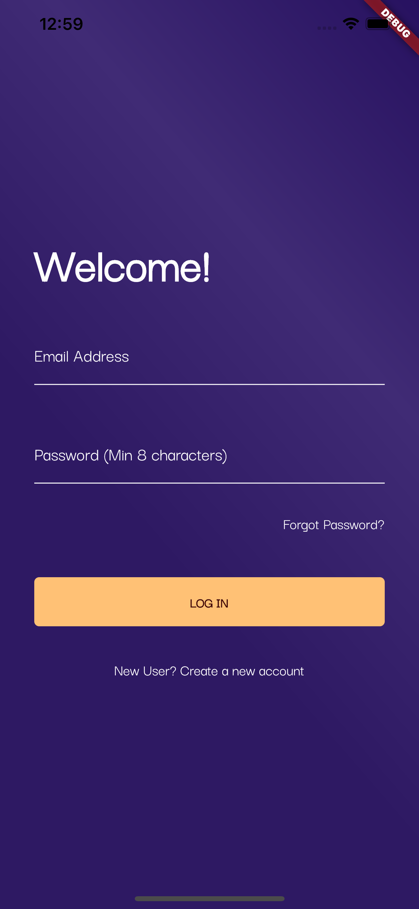
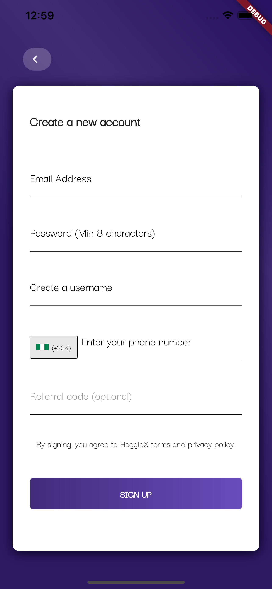
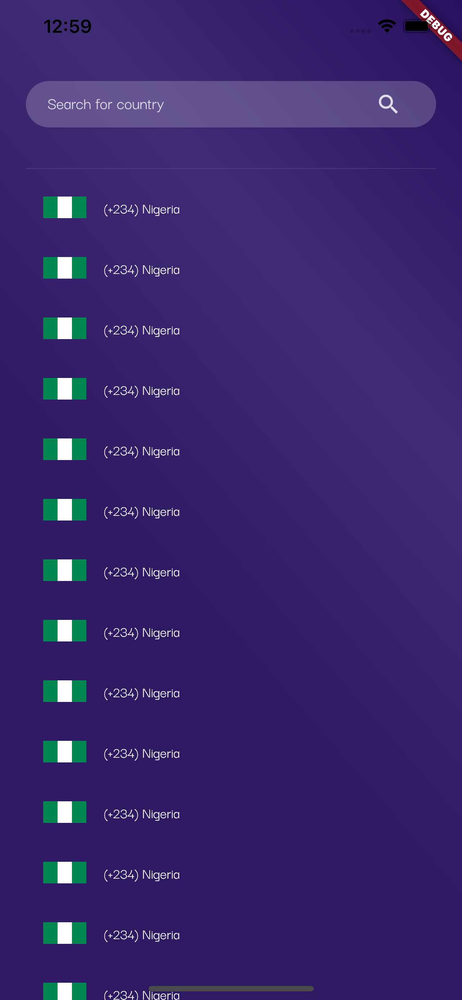
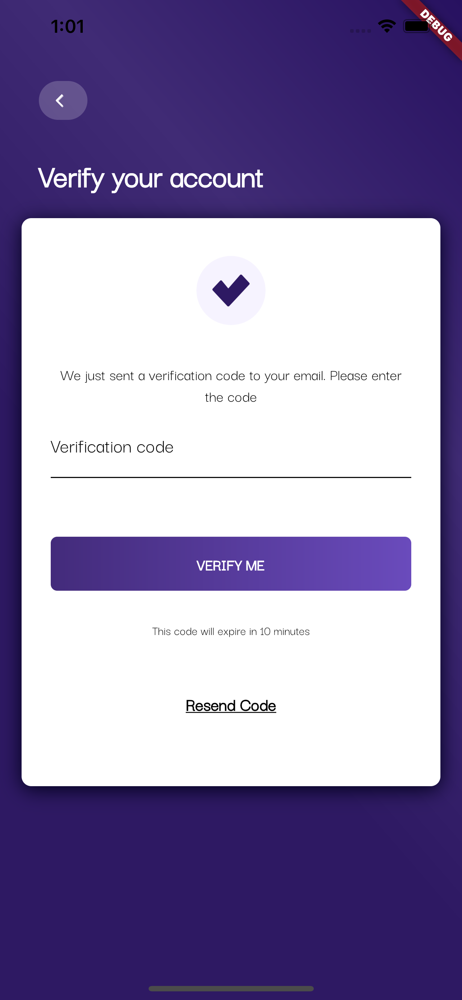

# HaggleX

[HaggleX](https://www.hagglex.com/) - Recreated Flutter Application

## Usage

Create a .env file in this project root folder and declare your GraphQL base url using this pattern below;

BASE_URL=https://sample_base_url.com

and the file and try running the app on your computer.

## Features
- Login and Logout
- Register
- Email Verification

## Tools
- Flutter
- GraphQL

## Architecture
 - Clean architecture

## Developer
### Charles Archibong
- [contact@charlesarchibong.dev](mailto:contact@charlesarchibong.dev)
- [LinkedIn](https://www.linkedin.com/in/charles-archibong)
- [GitHub](https://github.com/charlesarchibong/)

**Screenshots**

